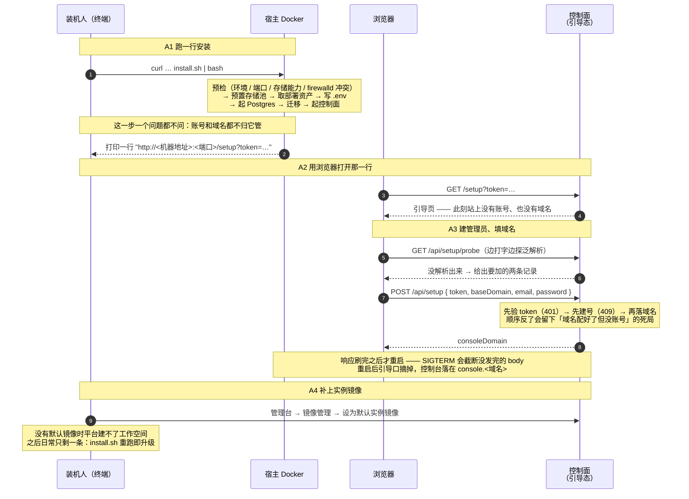
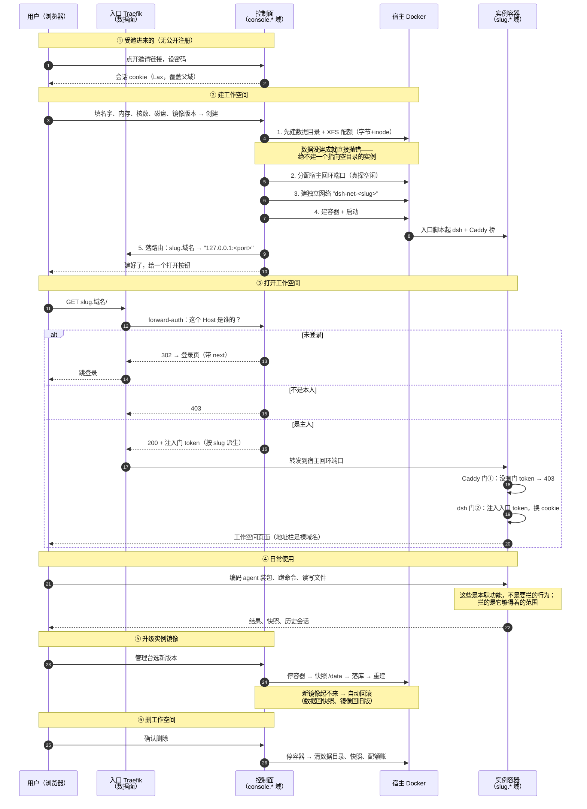
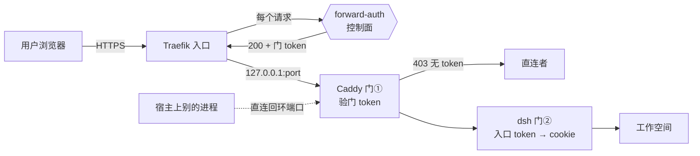

# 用户旅程：两类人，两条路

> 双列对照：左列是**人看到的**，右列是**平台实际做的**。
> 链路以代码为准（[install.sh](../scripts/install.sh) / [setup-routes.ts](../apps/server/src/http/setup-routes.ts) /
> [forward-auth.ts](../apps/server/src/http/forward-auth.ts) / [provisioner.ts](../apps/server/src/instance/provisioner.ts) /
> [Caddyfile](../docker/instance-image/Caddyfile) / [entrypoint.sh](../docker/instance-image/entrypoint.sh)），
> 隔离性质以 [CONTAINER-ISOLATION-TEST-REPORT](CONTAINER-ISOLATION-TEST-REPORT.md) 的实测为准。
>
> 网页版（带样式、可打印）：[user-journey.html](user-journey.html)。

**装机人**在宿主上跑一次安装，把平台支起来；**普通用户**从邀请链接进来用工作空间。两条路只在「谁发出邀请」这一点上相交。

---

## A · 装机人的旅程（宿主上 · 一次性）

| 步 | 装机人的操作 | 实际发生的事情 |
|---|---|---|
| A1 | 把 README 里那行 `curl … install.sh \| bash` 贴进终端 | 四件事、**顺序不能换**：预检（环境 / 端口 / 存储能力，含 firewalld 冲突探查）→ 预置存储池 → 取部署资产并渲染配置 → 起 Postgres、迁移、起控制面。安装这一步**一个问题都不问**：账号和域名都不归它管 |
| A2 | 复制终端最后打印的那条 `http://<机器地址>:<端口>/setup?token=…`，用浏览器打开 | 此刻平台上**还没有账号也没有域名**，这页是唯一入口，token 是它唯一的凭证 —— 引导态下整站只开着这一条写口（`POST /api/setup`）。重跑安装**不会**换掉它：刻意保留，换了就等于把刚打印给你的链接作废 |
| A3 | 填管理员邮箱、密码、父域；顺手把 `*.<域名>` 的泛解析指过来 | 页面边填边**真探 DNS**，没就绪就直接给出要加的两条记录（只警告不拦，平台判不了 CDN / 反代 / 生效中）。提交后**先验 token、再建号、最后落域名**，然后等响应刷完才重启：引导口摘掉，控制台从此落在 `console.<域名>` |
| A4 | 登录管理台，进「镜像管理」，把实例镜像设为默认 | 没有默认实例镜像时平台建不了工作空间 —— 装机到此才真正可用。之后日常只剩一条命令：`install.sh` 重跑即升级（幂等；除非 `FORCE_SECRETS=1`，**绝不重生成 secret**，换了它所有实例的门 token 全废） |

---

## B · 普通用户的旅程（从邀请到删除）

| 步 | 用户的操作 | 实际发生的事情 |
|---|---|---|
| ① | 点开邀请链接、设密码 | 邀请码核销（并发下真正的闸门是邮箱唯一约束）、账号落库；发会话 cookie（Lax、覆盖父域——实例子域上 forward-auth 要读它）。邀请由 A4 之后的装机人在管理台发出 |
| ② | 填名字、内存、核数、磁盘、镜像版本，点创建 | **先有数据再有实例**：建目录 + XFS 配额（字节与 inode 双限，限额失效会拒绝启动）；真探宿主端口空闲；建 `dsh-net-<slug>` 独立网络；建容器并启动。任何一步失败，实例标 error，不会出现「照常跑但数据没了」 |
| ③ | 点「打开工作空间」 | 浏览器进 `slug.域名`。Traefik 每个请求先问控制面：这个子域是谁的？未登录→302 登录页；不是本人→403；是主人→注入按 slug 派生的门 token 再转发。容器里 Caddy 验这个 token（没有→403），再注入 dsh 的入口 token 换成 cookie——此后地址栏一直是裸域名 |
| ④ | 用 agent 干活：装包、跑命令、读写文件 | 全部发生在**一个容器 + 绑定存储**里。网络出得去（装包）、邻居够不着（独立网络）、磁盘有硬限（XFS 配额）、CPU/内存/进程数由 cgroup 限着 |
| ⑤ | 升级实例镜像 | 停容器→快照 `/data`→落库→按新镜像重建。新镜像起不来**自动回滚**：数据回快照、镜像回旧版。升级按实例灰度，不是全站一刀切 |
| ⑥ | 删除 | 数据真删：容器、数据目录、升级快照、配额账一起清 |

## 三道门的位置（配合 B③ 看）

- **forward-auth（Traefik→控制面）**：门外第一道，认人。每个请求都过，未登录跳登录、不是本人 403。
- **门①（容器内 Caddy）**：验 Traefik 注入的门 token。它挡的是**宿主上直连回环端口的其他进程**——端口发布在宿主回环上，任何本地进程都够得着，这道门就是给它们准备的。
- **门②（dsh 自己）**：入口 token 换 cookie，让地址栏保持裸域名。

配置住在容器里、实例主人能改——它是有效障碍，但按 [ISOLATION-PLAN](ISOLATION-PLAN.md) 的判据**不计入安全边界**；计入边界的是 forward-auth 和宿主侧那几层。

## 与隔离方案的关系

这个旅程里人**感知不到**的边界，就是 [ISOLATION-PLAN](ISOLATION-PLAN.md) 要维护的东西：

| 旅程中的动作 | 背后的边界（实测过） |
|---|---|
| A3 落域名 | 引导口是引导态下唯一的写口；配好域名即摘掉，`SETUP_TOKEN` 随之失效 |
| B② 创建 | XFS project quota：限 256 MiB 写 400 MiB 停在 256；inode 限 2000 建到第 1998 个被拒 |
| B③ 打开 | 独立网络：邻居 TIMEOUT、ARP 表只剩网关一条 |
| B③ 打开 | 桥端口只发布宿主回环；实例够得到宿主非回环（`:22`）——`--harden-host` 堵的就是这条 |
| B④ 干活 | cgroup：`pids.max`、`memory.max` 与界面设置逐项一致 |
| B④ 干活 | 遮蔽表 13 条写死（含 `/sys/devices/virtual/dmi`——宿主身份不给读） |
| B④ 干活 | 非 root：工作负载以固定 `1000:1000` 跑，`/data` 的属主由平台侧在建容器前递归迁 |
| B④ 干活 | `no-new-privileges`：容器里的 setuid 二进制与文件能力不再提权 |

批 1 的运行时加固（`no-new-privileges` 与非 root 已落定；CapDrop 待做；seccomp 决定不做）全部落在 B② 的「建容器」那一步——所以存量实例要重建一次才带得上，而人在旅程中看到的中断，只是 B③ 打开时慢几秒。
